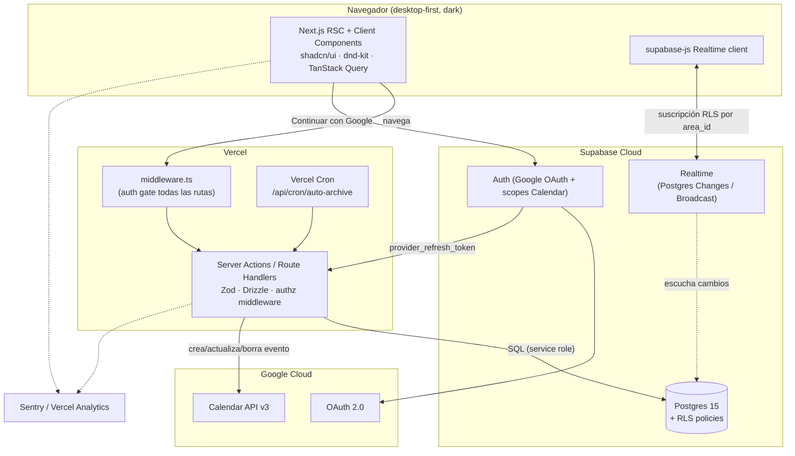
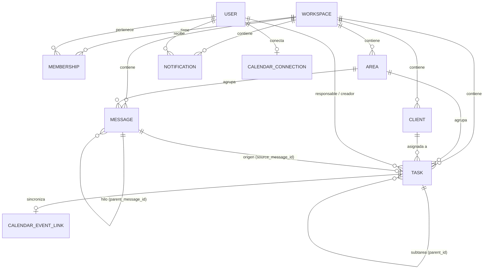
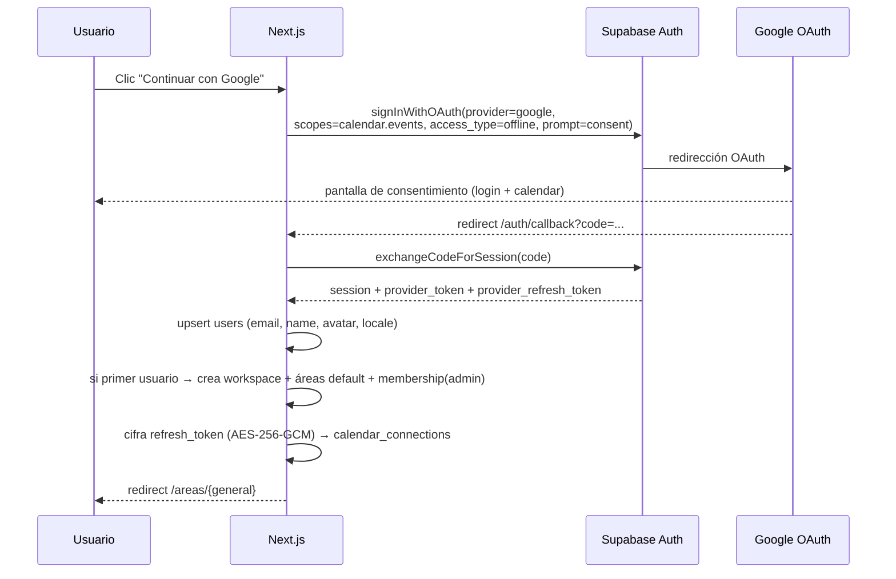

# Tandem — Arquitectura

> Documento de arquitectura técnica. Deriva de `IDEA-PROYECTO.md` v0.4 (spec funcional CERRADA).
> Respeta los principios ARQ-01 a ARQ-12 (sección 4.3 del spec) y las restricciones del Prompt 0.

---

## 1. Resumen ejecutivo

Tandem es una app web desktop-first (dark mode único, ES/EN) para 2 cofounders, con margen de escalar a ~10 usuarios. Las exigencias técnicas dominantes son:

- **Velocidad de MVP** sin hipotecar la escalabilidad.
- **Real-time** en chat y tablero Kanban.
- **Aislamiento de datos por workspace** (multi-tenant desde el diseño, ARQ-07).
- **Google OAuth** como único login + **Google Calendar** sync unidireccional (ARQ-06, ARQ-12).
- **Modelo de datos centrado en Task** con `parent_id` recursivo (ARQ-02, ARQ-03).

La combinación elegida —**Next.js (App Router) + Supabase (Postgres + Auth + Realtime + RLS) + Drizzle ORM**— cubre todo lo anterior con el menor número de piezas móviles y un ecosistema maduro.

---

## 2. Stack recomendado

| Capa | Tecnología | Justificación |
|---|---|---|
| **Framework** | **Next.js 15 (App Router) + React 19 + TypeScript strict** | RSC + Server Actions reducen el boilerplate de API; un solo deploy en Vercel; SSR para layout dark sin flash. |
| **UI** | **Tailwind CSS v4 + shadcn/ui (Radix primitives)** | Componentes accesibles (keyboard nav, aria) sin reinventar; theming por CSS variables encaja con "dark único" (ARQ-10). |
| **Drag & drop** | **dnd-kit** | Accesible, ligero, soporta teclado; idóneo para Kanban (TASK-03/04). |
| **Tipografía** | **General Sans** (cuerpo) + **Clash Display** (títulos) vía Fontshare; **Geist Mono** para código | Distintiva, NO Inter/Roboto (UX-08). Self-host vía `next/font` para evitar layout shift. |
| **Base de datos** | **Supabase Postgres 15** | Relacional encaja con "entidades planas + muchas FK" (ARQ-01); soporta `parent_id` recursivo con CTEs; RLS nativa para aislamiento (ARQ-07, ARQ-11). |
| **ORM / migraciones** | **Drizzle ORM + drizzle-kit** | Type-safe end-to-end, migraciones SQL versionadas, sin runtime pesado. Las queries de escritura van por Server Actions. |
| **Auth** | **Supabase Auth (provider Google OAuth)** con scopes de Calendar | Un solo flujo OAuth con scopes combinados (ARQ-06); gestiona sesión + cookies httpOnly; devuelve `provider_refresh_token` para Calendar. |
| **Real-time** | **Supabase Realtime** (Postgres Changes + Broadcast) | Sin servidor WebSocket propio; canales por `area_id`; RLS aplica a la suscripción (ARQ-05). |
| **Validación** | **Zod** | Esquemas compartidos cliente/servidor; valida todo input server-side (SEC). |
| **Data fetching cliente** | **TanStack Query** | Cache, optimistic UI en chat y tablero, reconciliación con eventos realtime. |
| **Forms** | **react-hook-form + @hookform/resolvers (zod)** | Formularios de tarea/cliente con validación declarativa. |
| **i18n** | **next-intl** | App Router nativo, mensajes por keys, formato de fechas localizado (I18N-05). |
| **Google APIs** | **googleapis** (Node client) | Cliente oficial para Calendar events. |
| **Testing** | **Vitest + Testing Library + Playwright + MSW** | Pirámide completa; MSW mockea Google Calendar y Supabase en unit/integration. |
| **Cron** | **Vercel Cron** → Route Handler protegido | Auto-archivado a 7 días (ARC-01); sin infra extra. |
| **Hosting** | **Vercel** (app) + **Supabase Cloud** (DB/Auth/Realtime) | `tandem.integrascale.online`; preview deploys por PR. |
| **Observabilidad** | **Sentry** + **Vercel Analytics** | Errores y métricas básicas. |

### 2.1 Por qué Supabase y no Auth.js + Neon + Pusher

Para un MVP de 2 usuarios, Supabase agrupa **Auth + Postgres + Realtime + RLS** en un solo servicio. La alternativa (Auth.js + Neon + Ably/Pusher) introduce 3 servicios, 3 conjuntos de credenciales y la necesidad de un servidor de presencia. Supabase Auth además expone `provider_refresh_token` de Google, que es justo lo que necesitamos para Calendar (sección 9). Decisión registrada en **ADR-001**.

### 2.2 Por qué Drizzle conviviendo con RLS (defensa en profundidad)

- **Escrituras**: Server Actions ejecutan con Drizzle vía conexión Postgres del *service role*. La autorización se valida **explícitamente en la capa de aplicación** (`assertMembership(workspaceId, userId)`) antes de cada mutación. Es la barrera principal (ARQ-11).
- **Lecturas en tiempo real**: el cliente del navegador usa `supabase-js` con la sesión del usuario; **RLS** filtra por `workspace_id` a nivel de fila. Es la segunda barrera y la que hace seguras las suscripciones Realtime.

Así ningún canal Realtime puede filtrar datos de otro workspace aunque la app cliente tuviera un bug. Decisión en **ADR-004**.

---

## 3. Diagrama de arquitectura



---

## 4. Modelo de datos (ER)



### 4.1 Tablas, campos, tipos e índices

Convenciones: `id uuid default gen_random_uuid()`, `created_at timestamptz default now()`, `updated_at timestamptz` (trigger). Todas las entidades de negocio llevan `workspace_id` (ARQ-07).

#### `workspaces`
| Campo | Tipo | Notas |
|---|---|---|
| id | uuid PK | |
| name | text NOT NULL | WS-02 |
| owner_user_id | uuid FK→users | primer usuario = admin (AUTH-07) |
| created_at | timestamptz | |

#### `users`
| Campo | Tipo | Notas |
|---|---|---|
| id | uuid PK | = `auth.users.id` de Supabase |
| email | text UNIQUE NOT NULL | de Google |
| name | text | de Google (AUTH-02) |
| avatar_url | text | de Google |
| locale | text NOT NULL default `'es'` | `'es'` \| `'en'` (AUTH-02/I18N-03) |
| created_at | timestamptz | |

#### `memberships` (M:N usuario↔workspace, prepara multi-usuario)
| Campo | Tipo | Notas |
|---|---|---|
| id | uuid PK | |
| workspace_id | uuid FK→workspaces NOT NULL | |
| user_id | uuid FK→users NOT NULL | |
| role | text NOT NULL default `'member'` | `'admin'` \| `'member'` \| `'viewer'`(fase2) (SCL-02) |
| created_at | timestamptz | |

Índices: `UNIQUE(workspace_id, user_id)`, `idx_memberships_user (user_id)`.

#### `workspace_invitations`
| Campo | Tipo | Notas |
|---|---|---|
| id | uuid PK | |
| workspace_id | uuid FK NOT NULL | |
| email | text NOT NULL | invitado (WS-04) |
| role | text NOT NULL default `'member'` | |
| token | text UNIQUE NOT NULL | acepta vía link |
| invited_by | uuid FK→users | |
| accepted_at | timestamptz NULL | |
| expires_at | timestamptz NOT NULL | |

#### `areas`
| Campo | Tipo | Notas |
|---|---|---|
| id | uuid PK | |
| workspace_id | uuid FK NOT NULL | |
| name | text NOT NULL | único en workspace (AREA-03) |
| color | text NULL | identificador visual (AREA-10) |
| icon | text NULL | |
| position | integer NOT NULL default 0 | orden en sidebar |
| is_default | boolean NOT NULL default false | General/Marketing/Desarrollo/SAC (WS-05) |
| created_by | uuid FK→users | |
| created_at | timestamptz | |

Índices: `UNIQUE(workspace_id, lower(name))`, `idx_areas_ws (workspace_id, position)`.

#### `clients`
| Campo | Tipo | Notas |
|---|---|---|
| id | uuid PK | |
| workspace_id | uuid FK NOT NULL | |
| name | text NOT NULL | obligatorio (CLI-03) |
| email | text NULL | |
| company | text NULL | |
| phone | text NULL | |
| notes | text NULL | |
| is_active | boolean NOT NULL default true | inactivos ocultos en selectores (CLI-05) |
| owner_user_id | uuid FK→users NULL | encargado (CLI-04) |
| created_at | timestamptz | |

Índices: `idx_clients_ws (workspace_id)`, `idx_clients_active (workspace_id, is_active)`.

#### `tasks` — entidad central (ARQ-02)
| Campo | Tipo | Notas |
|---|---|---|
| id | uuid PK | |
| workspace_id | uuid FK NOT NULL | |
| area_id | uuid FK→areas NOT NULL | exactamente 1 área (regla §3.2) |
| client_id | uuid FK→clients NULL | dimensión filtrable |
| parent_id | uuid FK→tasks NULL | subtarea recursiva (ARQ-03, SUB-02) |
| title | text NOT NULL | ≤200 chars |
| description | text NULL | |
| status | text NOT NULL default `'por_hacer'` | `por_hacer`\|`en_proceso`\|`completada` |
| priority | text NOT NULL default `'media'` | `alta`\|`media`\|`baja` |
| assignee_user_id | uuid FK→users NULL | pool sin asignar permitido (D09) |
| created_by | uuid FK→users NOT NULL | |
| due_date | timestamptz NULL | dispara sync calendar (CAL-06) |
| position | numeric NOT NULL default 0 | orden manual en columna (TASK-04) |
| source_message_id | uuid FK→messages NULL | origen chat (MSG-12) |
| archived_at | timestamptz NULL | archivo = flag (ARQ-08, ARC) |
| completed_at | timestamptz NULL | base para auto-archivar a 7 días |
| created_at | timestamptz | |
| updated_at | timestamptz | |

Índices:
- `idx_tasks_board (workspace_id, area_id, status, position)` — query principal del tablero.
- `idx_tasks_parent (parent_id)` — subtareas.
- `idx_tasks_client (workspace_id, client_id)` — ficha cliente (CLI-06) y filtro (BRD-03).
- `idx_tasks_assignee (workspace_id, assignee_user_id)`.
- `idx_tasks_archive (workspace_id, archived_at)` — vista archivo + cron.
- Parcial: `idx_tasks_autoarchive (completed_at) WHERE status='completada' AND archived_at IS NULL` — cron eficiente.

**Reglas de integridad** (capa app + checks):
- `parent_id` debe compartir `workspace_id` y `area_id` con la raíz (área heredada, SUB-09).
- Solo tareas con `parent_id IS NULL` aparecen en el tablero (BRD-07).
- No permitir ciclos en `parent_id` (validación en Server Action al reasignar padre).

#### `messages`
| Campo | Tipo | Notas |
|---|---|---|
| id | uuid PK | |
| workspace_id | uuid FK NOT NULL | |
| area_id | uuid FK→areas NOT NULL | scoped al área (ARQ-04, MSG-08) |
| parent_message_id | uuid FK→messages NULL | respuesta en hilo (TH-01) |
| author_user_id | uuid FK→users NOT NULL | |
| body | text NOT NULL | solo texto + URLs (MSG-02) |
| edited_at | timestamptz NULL | muestra "(editado)" (MSG-05) |
| deleted_at | timestamptz NULL | soft delete (MSG-06) |
| created_at | timestamptz | |

Índices: `idx_messages_area (workspace_id, area_id, created_at)`, `idx_messages_thread (parent_message_id, created_at)`.

> **MessageThread**: el spec lista "MessageThread" como entidad. Decisión (**ADR-006**): *no* se crea tabla separada; un hilo es el conjunto de `messages` con un `parent_message_id` dado. El contador "N respuestas" (TH-03) es un `COUNT(*)`/columna derivada cacheada. Esto evita duplicar entidades (ARQ-01).

#### `notifications`
| Campo | Tipo | Notas |
|---|---|---|
| id | uuid PK | |
| workspace_id | uuid FK NOT NULL | |
| recipient_user_id | uuid FK→users NOT NULL | |
| type | text NOT NULL | `task_assigned`\|`task_status_changed`\|`thread_reply`\|`subtasks_completed` (NOT-02) |
| entity_type | text NOT NULL | `task`\|`message`\|`area` |
| entity_id | uuid NOT NULL | destino del clic (NOT-03) |
| actor_user_id | uuid FK→users NULL | quién la disparó |
| payload | jsonb NULL | datos para render |
| read_at | timestamptz NULL | |
| created_at | timestamptz | |

Índices: `idx_notif_recipient (recipient_user_id, read_at, created_at)`.

#### `calendar_connections` — un Google Calendar por usuario (CAL-05, D14)
| Campo | Tipo | Notas |
|---|---|---|
| id | uuid PK | |
| workspace_id | uuid FK NOT NULL | |
| user_id | uuid FK→users NOT NULL | |
| provider | text NOT NULL default `'google'` | |
| google_email | text | cuenta conectada |
| access_token_enc | bytea NOT NULL | **cifrado at rest** (SEC-06) |
| refresh_token_enc | bytea NOT NULL | **cifrado at rest** |
| token_expires_at | timestamptz | |
| scope | text | scopes concedidos |
| calendar_id | text NOT NULL default `'primary'` | |
| created_at | timestamptz | |

Índices: `UNIQUE(user_id)`.

#### `calendar_event_links` — relaciona Task ↔ evento Google (CAL-06/08)
| Campo | Tipo | Notas |
|---|---|---|
| id | uuid PK | |
| workspace_id | uuid FK NOT NULL | |
| task_id | uuid FK→tasks NOT NULL | |
| user_id | uuid FK→users NOT NULL | dueño del calendario donde vive el evento |
| google_event_id | text NOT NULL | para update/delete |
| calendar_id | text NOT NULL default `'primary'` | |
| last_synced_at | timestamptz | |
| sync_state | text NOT NULL default `'synced'` | `synced`\|`pending`\|`error` |

Índices: `UNIQUE(task_id)`, `idx_cel_task (task_id)`.

### 4.2 Tipos enumerados

Se implementan como **Postgres `enum`** (o `text` + CHECK) para `task.status`, `task.priority`, `membership.role`, `notification.type`. Drizzle los modela con `pgEnum`. Decisión en **ADR-005** (enum nativo por integridad; valores en español para alinear con el spec: `por_hacer`, `en_proceso`, `completada`).

### 4.3 Consultas clave

- **Tablero** (BRD-01/02): `SELECT * FROM tasks WHERE workspace_id=$1 AND area_id=$2 AND parent_id IS NULL AND archived_at IS NULL [AND client_id…] ORDER BY status, position`.
- **Progreso recursivo de subtareas** (SUB-06): CTE recursiva contando descendientes completados / total.
- **Ficha cliente** (CLI-06): tasks por `client_id` agrupadas por `area_id`, todas las áreas (CLI-09).
- **Auto-archivar** (ARC-01): `UPDATE tasks SET archived_at=now() WHERE status='completada' AND archived_at IS NULL AND completed_at < now()-interval '7 days'`.

---

## 5. Arquitectura de la aplicación

### 5.1 Patrón de capas
```
UI (RSC + Client Components)
  └─ Server Actions / Route Handlers   ← frontera de confianza
       ├─ authz: assertMembership(workspaceId, userId)
       ├─ validación: Zod schema
       ├─ servicios de dominio (tasks, messages, clients, calendar…)
       │     └─ Drizzle (Postgres)
       └─ side-effects: Calendar sync, notifications, realtime broadcast
```
Toda mutación pasa por un Server Action que **primero** valida sesión + membership, **luego** valida el body con Zod, **luego** ejecuta. Nunca se confía en `workspace_id`/IDs enviados sin verificar pertenencia (ARQ-11, SEC).

### 5.2 Real-time (ARQ-05)

| Dónde | Estrategia |
|---|---|
| **Chat por área** | Suscripción a Postgres Changes en `messages` filtrado por `area_id`; RLS garantiza scope a workspace. Optimistic UI al enviar (TanStack Query). |
| **Hilos** | Misma suscripción; el panel lateral filtra por `parent_message_id`. |
| **Tablero** | Postgres Changes en `tasks` filtrado por `area_id`; reconciliación de posición/estado en cliente. |
| **Notificaciones** | Postgres Changes en `notifications` filtrado por `recipient_user_id`. |
| **Calendario/clientes** | Sin realtime; refetch normal (ARQ-05). |

Canales nombrados `ws:{workspace_id}:area:{area_id}`. Reconexión automática la gestiona `supabase-js`. Eventos lógicos mapeados (para el agente Real-time): `message.created/updated/deleted`, `thread.reply.created`, `task.created/updated/moved/deleted`, `notification.created`.

### 5.3 i18n (ARQ-09, sección 6.12)

- **next-intl** con catálogos `messages/es.json` y `messages/en.json`; **ES default** (I18N-02).
- Todas las strings por **key**, cero hardcode (regla Frontend).
- Idioma por usuario: se lee de `users.locale` y se persiste; selector en Configuración (I18N-03).
- Fechas/números con `Intl` según locale: ES `dd/mm/yyyy`, EN `mm/dd/yyyy` (I18N-05).
- Contenido de usuario (mensajes, tareas) **no** se traduce (I18N-04).
- Enums de dominio se guardan en español en DB y se **muestran** vía keys de i18n (ej. `status.por_hacer` → "Por hacer"/"To do").

### 5.4 Estructura de carpetas (repo único)

```
tandem/
├── docs/                          # esta documentación
│   └── reports/                   # reportes de agentes por sprint
├── drizzle/                       # migraciones SQL generadas
├── messages/
│   ├── es.json
│   └── en.json
├── public/
│   └── robots.txt                 # noindex (SEC-05)
├── src/
│   ├── app/
│   │   ├── (auth)/
│   │   │   ├── login/page.tsx
│   │   │   └── auth/callback/route.ts   # OAuth callback
│   │   ├── (app)/
│   │   │   ├── layout.tsx               # shell dark + sidebar
│   │   │   ├── areas/[areaId]/page.tsx  # tablero + chat
│   │   │   ├── clients/...
│   │   │   ├── calendar/page.tsx
│   │   │   ├── archive/page.tsx
│   │   │   └── settings/...
│   │   ├── api/
│   │   │   ├── cron/auto-archive/route.ts
│   │   │   └── calendar/connect/route.ts
│   │   └── layout.tsx                    # <html> lang, theme, fonts
│   ├── components/
│   │   ├── ui/                  # shadcn/ui
│   │   ├── board/               # Kanban, dnd-kit
│   │   ├── chat/                # mensajes, hilos
│   │   ├── task/                # detalle, subtareas
│   │   ├── client/             # directorio, ficha
│   │   └── calendar/
│   ├── server/
│   │   ├── actions/             # Server Actions por dominio
│   │   ├── services/            # lógica de dominio (Drizzle)
│   │   ├── auth/                # sesión, assertMembership
│   │   ├── calendar/            # googleapis wrapper
│   │   └── realtime/            # helpers broadcast
│   ├── db/
│   │   ├── schema.ts            # Drizzle schema
│   │   └── client.ts            # conexión Postgres
│   ├── lib/
│   │   ├── zod/                 # esquemas compartidos
│   │   ├── crypto.ts            # cifrado de tokens (AES-256-GCM)
│   │   └── supabase/            # browser & server clients
│   ├── i18n/                    # config next-intl
│   └── middleware.ts            # auth gate (ARQ-11)
├── tests/
│   ├── unit/
│   ├── integration/
│   └── e2e/                     # Playwright
├── .env.example
├── drizzle.config.ts
├── vercel.json
└── package.json
```

---

## 6. Flujo Google OAuth + Calendar (ARQ-06)



**Decisiones (ADR-002, ADR-003):**
- **Scopes combinados** en un solo consentimiento: `openid email profile https://www.googleapis.com/auth/calendar.events`. `access_type=offline` + `prompt=consent` para garantizar `refresh_token` (Google solo lo emite la primera vez salvo `prompt=consent`).
- **Token storage**: `access_token`/`refresh_token` se cifran con **AES-256-GCM** usando `TOKEN_ENC_KEY` (env) y se guardan en `calendar_connections` como `bytea` (SEC-06). El `access_token` se refresca on-demand antes de cada llamada a Calendar; si el refresh falla, se marca `sync_state='error'` y se notifica al usuario para reconectar.
- **Calendar sync** es un **side-effect al guardar** la tarea (ARQ-12): al crear/editar `due_date` se invoca el servicio de calendar de forma síncrona dentro del Server Action (con manejo de error no bloqueante para la tarea). Detalle en `IMPLEMENTATION-PLAN.md` S4 y `SECURITY.md`.

---

## 7. Variables de entorno (`.env.example`)

```bash
# --- App ---
NEXT_PUBLIC_APP_URL=https://tandem.integrascale.online
NEXT_PUBLIC_DEFAULT_LOCALE=es

# --- Supabase ---
NEXT_PUBLIC_SUPABASE_URL=https://xxxx.supabase.co
NEXT_PUBLIC_SUPABASE_ANON_KEY=eyJ...          # cliente (RLS)
SUPABASE_SERVICE_ROLE_KEY=eyJ...              # server actions (bypass RLS) — NUNCA al cliente
DATABASE_URL=postgresql://...                 # Drizzle (pooled)
DIRECT_URL=postgresql://...                   # migraciones (no pooled)

# --- Google OAuth (configurado en Supabase Auth provider) ---
GOOGLE_CLIENT_ID=...
GOOGLE_CLIENT_SECRET=...

# --- Cifrado de tokens (SEC-06) ---
TOKEN_ENC_KEY=base64:...                      # 32 bytes para AES-256-GCM

# --- Cron ---
CRON_SECRET=...                               # protege /api/cron/*

# --- Observabilidad ---
SENTRY_DSN=...
```

> `SUPABASE_SERVICE_ROLE_KEY`, `GOOGLE_CLIENT_SECRET`, `TOKEN_ENC_KEY`, `CRON_SECRET` son **server-only**. Nunca prefijados con `NEXT_PUBLIC_`.

---

## 8. Architecture Decision Records (ADR)

| ADR | Decisión | Estado | Motivo / Trade-off |
|---|---|---|---|
| **ADR-001** | Supabase como Auth+DB+Realtime+RLS | Aceptada | Menos piezas, ecosistema maduro, `provider_refresh_token` listo. Trade-off: acoplamiento a Supabase (mitigable: Drizzle desacopla la capa SQL). |
| **ADR-002** | OAuth con scopes combinados (login + Calendar) en un consentimiento | Aceptada | UX y ARQ-06. Trade-off: el usuario ve permisos de Calendar al entrar; aceptable para herramienta interna. |
| **ADR-003** | Tokens cifrados AES-256-GCM en `bytea`, refresh on-demand | Aceptada | SEC-06. Alternativa (Supabase Vault) válida en fase 2. |
| **ADR-004** | Defensa en profundidad: authz en app (escrituras) + RLS (lecturas/realtime) | Aceptada | Seguridad de suscripciones realtime sin sacrificar velocidad de Server Actions. |
| **ADR-005** | Enums nativos Postgres con valores en español | Aceptada | Integridad referencial; display vía i18n keys. |
| **ADR-006** | Hilo de chat = `messages.parent_message_id`, sin tabla MessageThread | Aceptada | ARQ-01 (menos tablas). Contador como columna/COUNT. |
| **ADR-007** | Sync Calendar como side-effect síncrono al guardar tarea, no job/cola | Aceptada | ARQ-12, MVP rápido. Trade-off: latencia añadida al guardar; mitigada con timeout corto y `sync_state` para reintento. |
| **ADR-008** | Drag&drop con `position numeric` (fractional indexing) | Aceptada | Reordenar sin renumerar toda la columna (TASK-04). |
| **ADR-009** | Repo único (no monorepo) | Aceptada | 1 app Next.js full-stack; monorepo añade complejidad innecesaria al MVP. |
| **ADR-010** | next-intl sobre i18next | Aceptada | Integración nativa App Router/RSC. |

---

## 9. Cumplimiento de principios ARQ

| Principio | Cómo se cumple |
|---|---|
| ARQ-01 Entidades planas | 11 tablas, relaciones por FK; sin jerarquías artificiales. |
| ARQ-02 Task centro | `tasks` referencia área, cliente, responsable, creador, mensaje origen, subtareas. |
| ARQ-03 Subtareas = Task `parent_id` | Self-reference recursiva; misma lógica CRUD. |
| ARQ-04 Mensajes a Área | `messages.area_id`; cliente se asocia al convertir a tarea. |
| ARQ-05 Real-time selectivo | Chat/tablero/notifs realtime; clientes/calendario refetch. |
| ARQ-06 OAuth + Calendar mismo ecosistema | Un consentimiento, scopes combinados. |
| ARQ-07 Multi-usuario desde diseño | `workspace_id` en todas las entidades + `memberships`. |
| ARQ-08 Archivo = flag | `tasks.archived_at`, filtrado en queries. |
| ARQ-09 i18n día 1 | next-intl, keys, ES/EN. |
| ARQ-10 Dark único | CSS variables, un solo tema. |
| ARQ-11 Auth middleware global | `middleware.ts` protege todo salvo login/assets. |
| ARQ-12 Calendar = side-effect al guardar | Trigger en Server Action si cambia `due_date`. |

---

*Tandem — ARCHITECTURE.md. Base para IMPLEMENTATION-PLAN, API-SPEC, SECURITY, TESTING-STRATEGY, DEPLOY y AGENT-PROMPTS.*
