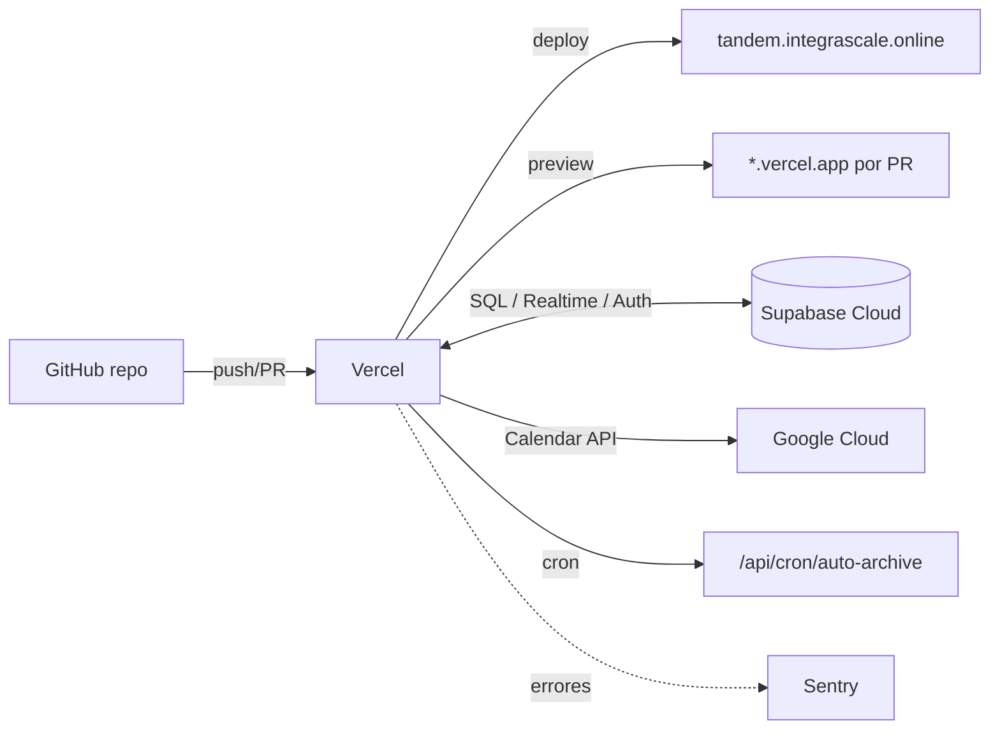

# Tandem — Deploy

> Setup de Vercel + Supabase + Google Cloud, dominio `tandem.integrascale.online`, cron de auto-archivado, monitoring y rollback.

---

## 1. Topología



- **App**: Vercel (Next.js).
- **Datos/Auth/Realtime**: Supabase Cloud (proyecto **prod** y proyecto **dev** separados — SEC checklist #25).
- **Calendar/OAuth**: Google Cloud Console.

---

## 2. Supabase

### 2.1 Proyectos
- Crear **dos** proyectos: `tandem-dev` y `tandem-prod` (DB de producción separada de dev).
- Región cercana a los usuarios (ej. `eu-west` o `us-east` según ubicación).

### 2.2 DB y migraciones
- Migraciones gestionadas por **Drizzle** (`drizzle/` + `drizzle-kit`).
- `DATABASE_URL` (pooled, puerto 6543) para runtime; `DIRECT_URL` (puerto 5432) para migraciones.
- Aplicar migraciones en cada deploy: paso `drizzle-kit migrate` en el pipeline (sección 6), apuntando a `DIRECT_URL` del entorno destino.
- **RLS**: las policies viven en la migración inicial (`0000_init.sql`); verificar `rowsecurity = true` en todas las tablas tras migrar.

### 2.3 Auth provider Google
- Supabase → Authentication → Providers → **Google**: pegar `GOOGLE_CLIENT_ID` y `GOOGLE_CLIENT_SECRET`.
- **Scopes adicionales**: `https://www.googleapis.com/auth/calendar.events`.
- Query params: `access_type=offline`, `prompt=consent` (para `refresh_token`).
- **Redirect URL** autorizada: `https://<proyecto>.supabase.co/auth/v1/callback`.
- Site URL: `https://tandem.integrascale.online`; redirect adicional para previews si se desea.

### 2.4 Realtime
- Habilitar Realtime en tablas `messages`, `tasks`, `notifications` (Postgres Changes).
- Confirmar que RLS está activa antes de exponer Realtime (filtra suscripciones).

### 2.5 Backups
- Activar **Point-in-Time Recovery / backups diarios** en el proyecto prod.

---

## 3. Google Cloud Console (OAuth + Calendar API)

1. Crear proyecto GCP `tandem`.
2. **APIs & Services → Enable APIs**: habilitar **Google Calendar API**.
3. **OAuth consent screen**: tipo *External*; en MVP modo *Testing* con los emails de los 2 cofounders como test users (evita verificación de Google mientras el scope `calendar.events` sea sensible). Pasar a *Production* requiere verificación; planificar antes de abrir a más usuarios.
4. **Credentials → OAuth Client ID** (Web application):
   - **Authorized JavaScript origins**: `https://tandem.integrascale.online`.
   - **Authorized redirect URIs**: `https://<proyecto>.supabase.co/auth/v1/callback`.
5. Copiar Client ID/Secret → Supabase Auth (2.3) y env vars.
6. Scopes solicitados: `openid email profile https://www.googleapis.com/auth/calendar.events`.

---

## 4. Vercel

### 4.1 Proyecto
- Importar el repo de GitHub. Framework preset: **Next.js**.
- **Production branch**: `main`. Preview deploys automáticos en cada PR.

### 4.2 Dominio
- Añadir dominio **`tandem.integrascale.online`** (subdominio recomendado por §3.4 del spec / Prompt 0).
- En el DNS de `integrascale.online`: registro **CNAME** `tandem` → `cname.vercel-dns.com` (o el que indique Vercel).
- Vercel emite el certificado TLS automáticamente (HTTPS forzado).

### 4.3 Env vars (por entorno: Production / Preview / Development)
Tomadas de `.env.example` (ARCHITECTURE §7). Marcar como **server-only** (sin `NEXT_PUBLIC_`): `SUPABASE_SERVICE_ROLE_KEY`, `GOOGLE_CLIENT_SECRET`, `TOKEN_ENC_KEY`, `CRON_SECRET`, `DATABASE_URL`, `DIRECT_URL`, `SENTRY_DSN`.
- `NEXT_PUBLIC_APP_URL` = `https://tandem.integrascale.online` (prod).
- Generar `TOKEN_ENC_KEY` (32 bytes) y `CRON_SECRET` con `openssl rand -base64 32`.

### 4.4 Headers de seguridad
Definir en `next.config.ts` (`headers()`) o `vercel.json`: HSTS, CSP, X-Frame-Options DENY, X-Content-Type-Options, Referrer-Policy, Permissions-Policy, `X-Robots-Tag: noindex` (ver SECURITY §10/11). `public/robots.txt` con `Disallow: /`.

---

## 5. Cron — auto-archivado (ARC-01)

`vercel.json`:
```json
{
  "crons": [
    { "path": "/api/cron/auto-archive", "schedule": "0 3 * * *" }
  ]
}
```
- Corre diario 03:00 UTC. El handler exige `Authorization: Bearer ${CRON_SECRET}`.
- Lógica: `UPDATE tasks SET archived_at=now() WHERE status='completada' AND archived_at IS NULL AND completed_at < now()-interval '7 days'`.
- Verificar tras el primer deploy: invocar manualmente con el secret y comprobar `{ archived: n }`.

---

## 6. CI/CD pipeline (resumen; detalle Prompt 7)

`.github/workflows/ci.yml` en cada PR:
1. install (cache) → 2. lint + `tsc --noEmit` → 3. unit/component (Vitest) → 4. integration (Postgres efímero + `drizzle-kit migrate` + RLS) → 5. security tests → 6. `next build` → 7. `npm audit` → 8. E2E (Playwright, smoke en PR) → 9. coverage gate.

Merge a `main`:
- E2E completo, luego Vercel despliega prod. Migraciones (`drizzle-kit migrate` con `DIRECT_URL` prod) corren en un step previo al deploy (o en `vercel build` hook) — **nunca** destructivas sin revisión.

---

## 7. Monitoring y logs

- **Sentry**: errores server + client (`SENTRY_DSN`), con scrubbing de PII (no enviar campos de cliente).
- **Vercel Analytics / Logs**: métricas básicas y logs de funciones.
- **Supabase**: logs de Postgres/Auth/Realtime en el dashboard.
- Alertas: error rate y fallos de sync de calendar (`sync_state='error'`).

---

## 8. Rollback

| Componente | Estrategia |
|---|---|
| **App (Vercel)** | "Promote previous deployment" → rollback instantáneo al deploy anterior (inmutables). |
| **DB (migraciones)** | Migraciones forward-only; para revertir, migración compensatoria. PITR/backup de Supabase para incidentes de datos. Probar restore en dev antes de prod. |
| **Env vars** | Cambios versionados manualmente; revertir valor en Vercel. |
| **Cron** | Desactivar el cron en `vercel.json` y redeploy si causa problemas. |

**Procedimiento de incidente**: 1) rollback de app en Vercel; 2) si afecta datos, evaluar PITR; 3) post-mortem breve en `/docs/reports/`.

---

## 9. Checklist pre-producción (Prompt 7)

- [ ] CI verde en `main` (incl. E2E completo).
- [ ] Deploy preview funcional verificado.
- [ ] Google OAuth funciona en `tandem.integrascale.online` (login + scope calendar).
- [ ] Migraciones aplicadas en prod; RLS activa en todas las tablas.
- [ ] DB prod separada de dev; backups/PITR activos.
- [ ] Cron auto-archive verificado.
- [ ] `robots.txt` + headers de seguridad presentes (curl de verificación).
- [ ] Solo usuarios autenticados acceden (E2E-12).
- [ ] Rollback probado al menos una vez.
- [ ] Security audit ✅ y QA ✅ (regla: no deploy sin ambos).

---

*Tandem — DEPLOY.md.*
